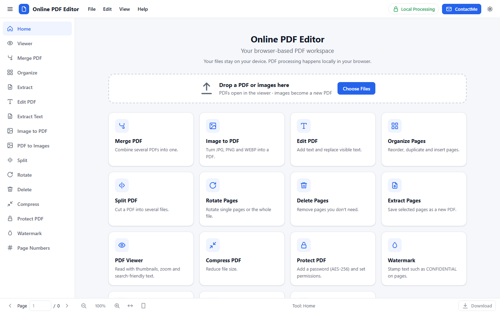
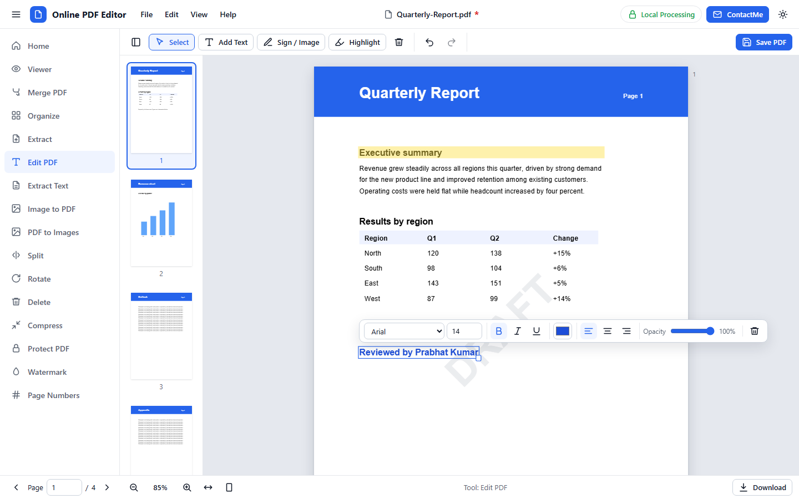
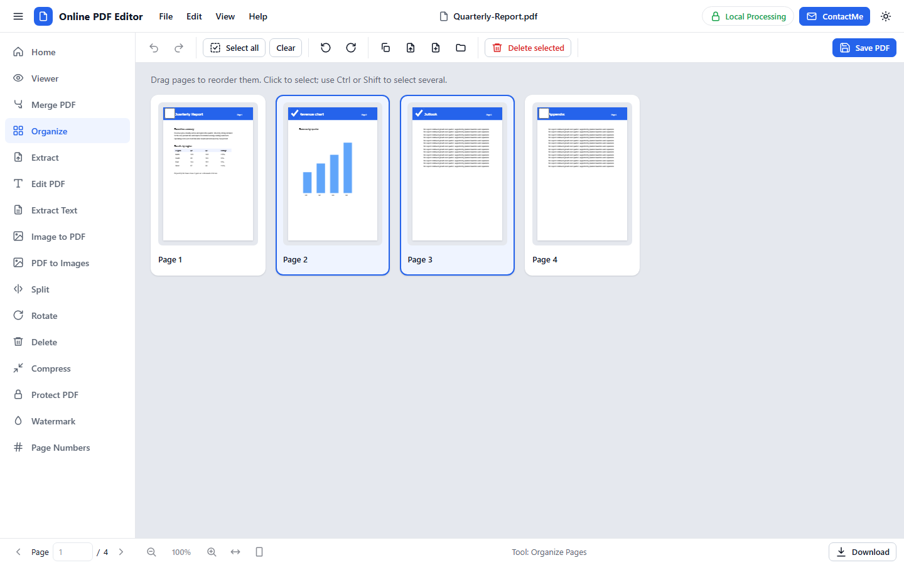
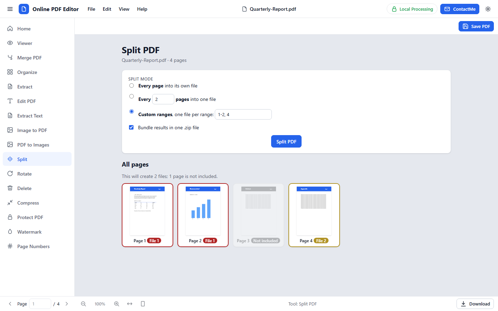
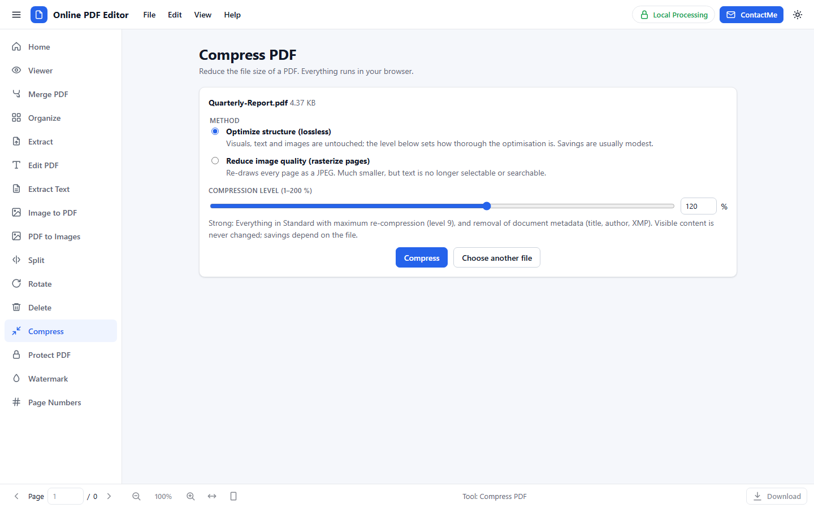
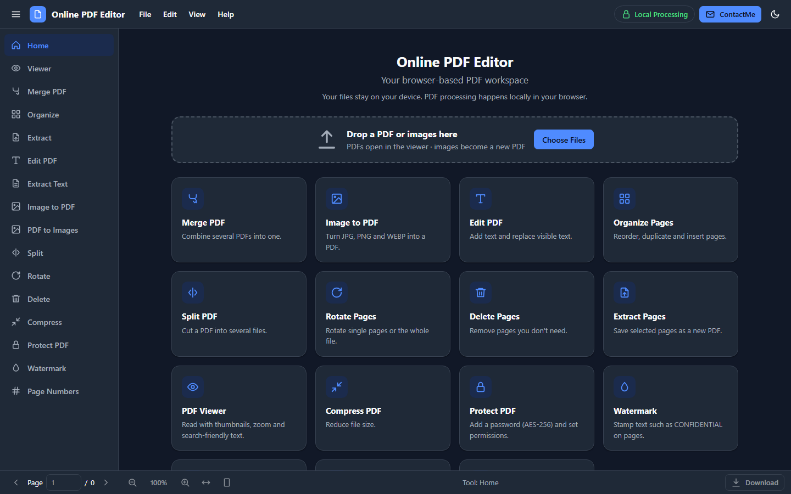
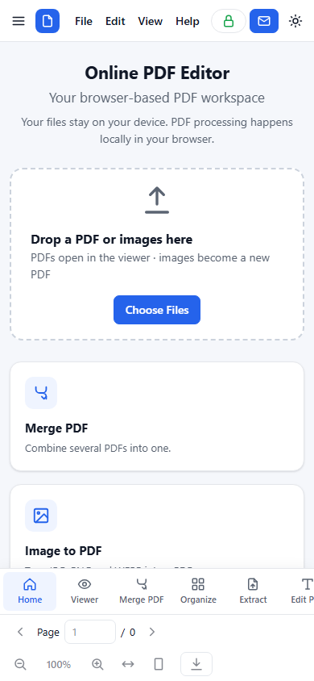

<div align="center">

# Online PDF Editor

**Edit, merge, split, protect and convert PDFs — entirely in your browser.**
Your files never leave your device. No uploads, no sign-up, no build step, no page limit.



**Developed By:** Prabhat Kumar &nbsp;·&nbsp; **Email:** [prabhatkumar9304@gmail.com](mailto:prabhatkumar9304@gmail.com)

</div>

---

## Contents

1. [Highlights](#highlights)
2. [Screenshots](#screenshots)
3. [Quick start](#quick-start)
4. [Features](#features)
5. [How-to recipes](#how-to-recipes)
6. [Guided tour & shortcuts](#guided-tour--keyboard-shortcuts)
7. [Privacy & security](#privacy--security)
8. [Limits & honest notes](#limits--honest-notes)
9. [Configuration](#configuration)
10. [Browser support](#browser-support)
11. [Project structure](#project-structure)
12. [Developer documentation](#developer-documentation)
13. [Troubleshooting](#troubleshooting)
14. [Roadmap](#roadmap)
15. [Credits & contact](#credits--contact)

---

## Highlights

| | |
|---|---|
| 🔒 **Private by design** | Everything runs locally with File/Blob/Canvas APIs. There is no server component. |
| 🧰 **Many tools in one app** | View, edit text, sign, highlight, merge, organize, split, rotate, delete, extract, compress, protect, watermark, number pages, convert to images or text. |
| ♾️ **No built-in limits** | No cap on file size, page count or number of files — only your device's free memory decides. Tested with 5,000-page documents. |
| ↩️ **Real undo/redo** | Every edit (text, moves, page operations, stamps) is undoable with <kbd>Ctrl</kbd>+<kbd>Z</kbd>. |
| 🔐 **Open & make protected PDFs** | Opens password-protected files; adds AES-256 passwords and permissions. |
| 🌗 **Light / dark / system theme** | Responsive from phone to desktop, keyboard accessible. |
| 🧭 **First-run guided tour** | Remembered in your browser and replayable from *Help → Take a Tour*. |
| 📦 **Zero build** | Plain HTML, CSS and JavaScript. Serve it from any static web server. |

## Screenshots

<table>
<tr>
<td width="50%"><b>Edit PDF</b> — click text to replace it, add text, sign, highlight, watermark<br></td>
<td width="50%"><b>Organize</b> — drag to reorder, rotate, duplicate, delete, extract<br></td>
</tr>
<tr>
<td width="50%"><b>Split</b> — live preview shows which file each page goes to<br></td>
<td width="50%"><b>Compress</b> — adjustable level for lossy and lossless methods<br></td>
</tr>
<tr>
<td width="50%"><b>Dark mode</b><br></td>
<td width="50%" align="center"><b>Phone layout</b> — bottom tool bar, ContactMe stays visible<br></td>
</tr>
</table>

## Quick start

It is a static site — **no Node, no bundler, no install.**

```bash
# from the project folder
python -m http.server 8000
# then open http://localhost:8000
```

Any static server works (nginx, `npx serve`, GitHub Pages, S3, …). The scripts are classic `<script>` tags rather than ES modules, so the app is designed to also work when `index.html` is opened directly from disk (`file://`); a web server is the tested route.

**Internet requirement:** the PDF libraries load from a CDN on first start (PDF.js and pdf-lib; JSZip for `.zip` output; the ~1.3 MB qpdf WebAssembly engine only when a password-protected PDF is opened or *Protect PDF* is used). Every library has a fallback URL. To run fully offline, download the files into a `libs/` folder and put those paths first in `APP_CONFIG.libs` (for qpdf, keep `qpdf.js` and `qpdf.wasm` side by side).

Want to skip the first-run tour (demos, screenshots)? Open `index.html?tour=0`.

## Features

### Create & combine
| Tool | What it does |
|---|---|
| **Image → PDF** | JPG, PNG, WEBP. Drag to reorder, rotate, remove, preview. Page size (A4, A3, Letter, Legal, original image size, custom), orientation, fit / fill / original size, margins, quality, background. JPEG/PNG are embedded losslessly when untouched; EXIF-rotated photos are handled. |
| **Merge PDF** | Add many PDFs, reorder (drag or Move up/down), remove, name the output. Password-protected files prompt for their password. |
| **Compress** | **Lossless** — optimizes structure at 1–200 % (Light → Standard → Strong → Maximum; visuals never change). **Lossy** — re-draws pages as JPEG at 0–200 % (0 = best quality, 200 = smallest; text becomes pixels). |

### Edit
| Tool | What it does |
|---|---|
| **Edit PDF** | Add text boxes; **click existing text to replace it**; move, resize, bold / italic / underline, font, size, colour, alignment, opacity; delete; nudge with arrow keys. A floating toolbar appears only when something is selected. |
| **Sign / Image** | Draw a signature (mouse, finger or pen) or upload an image, then place, move, resize and fade it. |
| **Highlight** | A movable, resizable translucent box (change colour and opacity). |
| **Watermark** | Text watermark — single or tiled, any direction, opacity, page range. Removable. |
| **Page Numbers** | `1`, `Page 1`, `Page 1 of N`, `1 / N`, `- 1 -` in any corner; start number; page range. |

### Pages
| Tool | What it does |
|---|---|
| **Organize** | Thumbnail grid: drag to reorder, multi-select, rotate, duplicate, delete, extract, insert a blank page, insert pages from another PDF. |
| **Split** | One file per page, every N pages, or custom ranges (`1-3, 4-6, 9`), optional `.zip`. A live grid of **all pages** shows which output file each page lands in. |
| **Rotate / Delete / Extract** | Focused versions of the organizer, with range inputs (`2-4, 7`). |
| **Viewer** | Continuous scroll, thumbnails, zoom (also <kbd>Ctrl</kbd>+wheel), fit width / page, page box, rotate current page, fullscreen, selectable text. |

### Convert & secure
| Tool | What it does |
|---|---|
| **PDF to Images** | PNG or JPG at 72 / 150 / 300 dpi for chosen pages; several pages are zipped. Includes your edits. |
| **Extract Text** | Shows the document's text; copy or download as `.txt`. |
| **Protect PDF** | Open password (AES-256), optional owner password, permissions (print / copy / modify / annotate). |
| **Open protected PDFs** | A password prompt (with *Show password*) appears wherever a protected PDF is loaded. |

Editing never changes the original file: **Save PDF** builds and downloads a *new* PDF. A `*` after the file name means unsaved changes, and leaving the page or closing the document asks first.

## How-to recipes

<details>
<summary><b>Replace text in a PDF</b></summary>

1. Open the PDF (drop it on the home page or press <kbd>Ctrl</kbd>+<kbd>O</kbd>) and choose **Edit PDF**.
2. Hover over text — it highlights. Click it, type the new text, press <kbd>Esc</kbd>.
3. Use the floating toolbar for font, size, colour. **Save PDF**.

If you leave without changing anything, the cover box is removed again automatically.
</details>

<details>
<summary><b>Sign a document</b></summary>

**Edit PDF → Sign / Image**, draw (or upload), **Add to page**, drag it into place, resize with the corner handle, **Save PDF**.
</details>

<details>
<summary><b>Merge, reorder and download</b></summary>

**Merge PDF** → drop files → drag cards into order → **Merge PDFs** → **Download** (or **Open PDF** to keep editing).
</details>

<details>
<summary><b>Split a report into chapters</b></summary>

**Split** → *Custom ranges* → `1-3, 4-7, 8-12`. The page grid below colours every page by the file it will go into; skipped pages are greyed out and marked *Not included*.
</details>

<details>
<summary><b>Password-protect, then reopen</b></summary>

Open the file → **Protect PDF** → set the open password and permissions → **Protect & download**. Opening the result anywhere asks for the password. In this app the prompt unlocks an in-memory copy for editing; save it again and it is unprotected unless you protect it again.
</details>

<details>
<summary><b>Shrink a large PDF</b></summary>

**Compress** → drop the file → try **Optimize structure** first (safe) → if it is still too big choose **Reduce image quality** and raise the level. Compare the sizes shown after each run.
</details>

## Guided tour & keyboard shortcuts

First-time visitors get a short spotlight tour. It is remembered in the browser (`localStorage` key `tourSeen`), never shown again automatically, and can be replayed from **Help → Take a Tour**. To see it again as a new user run `localStorage.removeItem("tourSeen")` in the console.

| Keys | Action |
|---|---|
| <kbd>Ctrl</kbd>+<kbd>O</kbd> | Open PDF |
| <kbd>Ctrl</kbd>+<kbd>S</kbd> (+<kbd>Shift</kbd> = Save As) | Save |
| <kbd>Ctrl</kbd>+<kbd>Z</kbd> | Undo |
| <kbd>Ctrl</kbd>+<kbd>Y</kbd> / <kbd>Ctrl</kbd>+<kbd>Shift</kbd>+<kbd>Z</kbd> | Redo |
| <kbd>Ctrl</kbd>+<kbd>+</kbd> / <kbd>-</kbd> / <kbd>0</kbd> | Zoom in / out / reset (also <kbd>Ctrl</kbd>+mouse wheel) |
| <kbd>Delete</kbd> | Delete the selected object or page(s) |
| <kbd>Esc</kbd> | Leave text editing, cancel *Add Text*, deselect, close dialogs |
| <kbd>Enter</kbd> | Edit the selected text box |
| Arrow keys (<kbd>Shift</kbd> = 10×) | Nudge the selected object |
| <kbd>Shift</kbd> / <kbd>Ctrl</kbd> + click | Select several objects or pages |
| <kbd>Ctrl</kbd>+<kbd>←</kbd> / <kbd>→</kbd> on a page | Move the focused page (Organize) |

*Help → Keyboard Shortcuts* shows the same list in the app.

## Privacy & security

* **Local-first.** Reading, rendering, editing and writing all happen in your browser tab. Documents are never uploaded; there is no server code, and `serverProcessing.enabled` is `false`.
* **Network use** is limited to downloading the open-source libraries from the CDN configured in `config.js`. Closing the tab discards everything held in memory.
* **Stored in your browser:** only two small preferences — `theme` and `tourSeen`. No documents, file names or passwords are stored.
* **Untrusted files:** text coming from files or PDFs is inserted with `textContent` (the small `Utils.h()` DOM builder never uses `innerHTML`); there is no `eval`; PDF.js runs with `isEvalSupported: false`; PDF scripts are never executed.
* **Passwords** are used only in memory by the qpdf WebAssembly engine inside your tab.
* Click **🔒 Local Processing** in the header for the in-app explanation.

## Limits & honest notes

PDF is a page-description format, not a word-processor format, so some things are inherently approximate:

* **Replacing existing text** draws a *cover rectangle* (background colour sampled from the page) plus *replacement text* on top. The original glyphs remain underneath in the file (still extractable by other tools), and replacement text uses a standard PDF font (Helvetica / Times / Courier families), so it can look different from the original font.
* **Character set:** only the standard fonts' Latin-1 (WinAnsi) characters can be written. Others (CJK, emoji, …) become `?` and you get a warning when saving.
* **Scanned / image-only PDFs** have no text to edit — the app says so and offers *Add Text*. **There is no OCR.**
* **Protected PDFs** open if you know the password. The working copy is decrypted in memory, so what you save is *not* protected unless you use *Protect PDF*. Permissions (print / copy / modify) are honoured by well-behaved viewers only; the open password is what really protects content. **A forgotten password cannot be recovered.**
* **Page operations** rebuild the document page by page, so form fields, bookmarks and some metadata may not survive. If you only add/replace text, the original is re-saved in place and keeps them.
* **Formatting** applies to a whole text box, not to a selection inside it.
* **No built-in size / page / file limits.** Large documents work because pages render lazily and off-screen canvases are released, but your device's memory is the real ceiling; if it runs out you get a friendly "Not enough memory" message. Optional caps exist in `config.js` and are off (`0`) by default.
* **Lossless compress** gives modest savings by design; the result screen tells you when a file could not be made smaller.

## Configuration

Everything tunable lives in [`config.js`](config.js) — nothing is hard-coded elsewhere (including the app name).

| Key | Default | Meaning |
|---|---|---|
| `appName`, `tagline`, `version`, `author` | *Online PDF Editor* … | Branding shown in the UI (title, header, About). |
| `developer.name`, `developer.email` | Prabhat Kumar | Used by **About** and the **ContactMe** button (mailto link and its tooltip). |
| `maxFileSizeMB` | `0` | Optional per-file cap (0 = none). |
| `maxFiles` | `0` | Optional cap on files added at once (0 = none). |
| `largeFileWarnMB` | `50` | Friendly heads-up above this size (0 = never). Does not block. |
| `renderMaxPixels` | `0` | Optional cap for one page canvas (0 = whatever the browser allows). |
| `defaultZoom`, `minZoom`, `maxZoom`, `zoomStep` | `1`, `0.25`, `4`, `0.1` | Viewer zoom (1 = 100 %). |
| `thumbWidth` | `140` | Thumbnail width in CSS px. |
| `historyLimit` | `50` | Undo steps kept (0 = unlimited). |
| `defaultFont`, `defaultFontSize`, `defaultTextColor`, `fonts`, `fontSizes` | Arial, 14, `#000000` | Text tool defaults and choices. |
| `defaultPageSize`, `defaultMargin`, `imageDpi` | A4, 20 pt, 96 | Image → PDF defaults. |
| `theme` | `system` | `light` / `dark` / `system` (the user's choice is remembered). |
| `enableDarkMode`, `enableDebug`, `enableLocalStorage`, `enableCompression` | `true`, `false`, `true`, `true` | Feature switches (`enableDebug` turns on `Logger` output). |
| `serverProcessing.enabled` | `false` | Reserved; no server component exists. |
| `libs.pdfjs`, `libs.pdfLib`, `libs.qpdf`, `libs.jszip` | CDN URLs | Library sources with fallbacks (see *Quick start* for offline use). |

## Browser support

Current **Chrome, Edge, Firefox and Safari** (desktop and mobile). Needs `IntersectionObserver`, `Blob`, `fetch`, Canvas 2D, CSS custom properties, and WebAssembly (only for protected PDFs). Fullscreen and `contenteditable="plaintext-only"` are feature-detected with fallbacks. Safari/iOS limit a single canvas to about 16.7 megapixels; other browsers allow far more.

## Project structure

```
index.html            application shell, SVG icon sprite, every view's static markup
style.css             all styling (tokens, light/dark, components, responsive)
config.js             APP_CONFIG
app.js                bootstrap, tool routing, global commands, shortcuts, drop routing
js/
  utils.js            Logger, Events (pub/sub), AppState, AppError, Utils (+ coordinate maths)
  toast.js            Toast notifications
  modal.js            Modal: open / alert / confirm / prompt (incl. password) / unsaved
  theme.js            light / dark / system, remembered in localStorage("theme")
  file-manager.js     validation, picker, object-URL lifecycle, downloads, filename prompt
  ui.js               action registry, menus, tooltips, dropzone, progress overlay, errors
  pdf-history.js      undo / redo (pushState, undo, redo, clear)
  pdf-viewer.js       lazy page rendering, layers, zoom, thumbnails
  pdf-tools.js        export/build, merge, split, compress, text drawing (pdf-lib + PDF.js)
  pdf-security.js     open protected PDFs, Protect PDF (qpdf WebAssembly, loaded on demand)
  pdf-pages.js        organizer grid, page operations, Split tool + live preview
  pdf-merge.js        Merge
  pdf-compress.js     Compress
  image-to-pdf.js     Image → PDF
  pdf-text-editor.js  annotation layer: text, highlight, images, floating toolbar
  pdf-stamp.js        watermark and page numbers (as ordinary text objects)
  pdf-export-tools.js PDF → images, PDF → text
  pdf-editor.js       the open document: model, history glue, save/close
  tour.js             first-run guided tour
assets/               icons and images
docs/screenshots/     images used in this README
test-assets/          small sample files for manual testing (safe to delete)
```

Scripts are loaded in dependency order by `index.html`. Modules are plain global objects (no bundler); each exposes `init()` and, where relevant, `reset() / cleanup() / destroy()`.

## Developer documentation

### Startup sequence
`config.js` → `Theme.init()` → `UI.init()` → module `init()`s → commands and shortcuts → home screen → libraries load (PDF.js + pdf-lib in parallel, with fallback URLs) → first-run tour. If a library fails to load, a "PDF Engine unavailable" dialog with *Retry* appears and tools that need the engine are gated by `App.ensureEngine()`. The PDF.js worker is fetched and started from a `blob:` URL because browsers refuse cross-origin workers. qpdf-wasm and JSZip are loaded lazily.

### Architecture
* **State** — `AppState` is the single source of truth; change it with `AppState.set(patch)` (emits `state:change`). `UI.refresh()` derives every enabled/disabled control, title, dirty star and page/zoom readout from it (`data-requires="doc|scroll|undo|redo|pagesel"`).
* **Events** — `Events.on/emit` pub/sub (`viewer:page-built`, `viewer:page-rendered`, `viewer:zoom`, `history:change`, `tool:shown`). The viewer never imports the editor; the editor subscribes.
* **Actions** — every button or menu item has `data-action="name"`; one delegated listener dispatches to handlers registered with `UI.register({...})`. No inline `onclick`.
* **Tool visibility** — elements with `data-tools="viewer editor …"` are shown only for those tools (`UI.applyToolVisibility`).
* **Public APIs** — `PDFEditor.open / save / addText / deleteSelected / undo / redo`, `PDFMerge.addFiles / removeFile / moveFile / merge`, `ImageToPDF.addImages / reorder / generate`, `PDFHistory.pushState / undo / redo / clear`, `downloadBlob(blob, name)`.

### Document model & history
`PDFEditor.doc = { name, sources[], pages[], objects{}, images{} }`

* `sources[]` — original bytes + PDF.js proxy; never modified.
* `pages[]` — `{ id, src, idx, rot, native, blank, geom:{x0,y0,w,h} }`: order, user rotation, native `/Rotate`, visible box.
* `objects[pageId][]` — annotations: `{ id, type:"text"|"rect"|"image", page, text, x, y, w, h, fontFamily, fontSize, color, bold, italic, underline, align, opacity, rotation, autoWidth, sourceKey?, stamp?, imageId? }`. New annotation types slot in here.
* `images{}` — PNG bytes for image/signature objects (outside history snapshots; objects hold only the id).

History snapshots are `JSON.stringify({pages, objects})` — small, no PDF bytes — kept up to `historyLimit` steps. Undo returns `isDirty` to `false` when it reaches the saved snapshot.

### Layers and zoom
Each page stacks: `canvas` → `.text-layer` (PDF.js, selectable) → `.sel-layer` (hit boxes over existing text) → `.annot-layer` (user objects). The three overlay layers are laid out **in PDF points** and scaled by one CSS variable (`--s = zoom × 96/72`) through `transform: scale(var(--s))`. Zooming changes one variable: all layers scale together and object coordinates never change. The bitmap is re-rendered at the right resolution after a short debounce; off-screen pages release their canvas (IntersectionObserver).

### Coordinate systems (`Utils`)
* **User space** — PDF native: points, origin bottom-left of the visible box, y up.
* **Display space** — as shown after rotation *R* (native `/Rotate` + user rotation): origin top-left, y down, points. Annotations live here.
* **Screen space** — display × `zoom × PX_PER_PT`.

`userToDisplay / displayToUser` (exact inverses for any rotation) and `pdfToScreenCoordinates / screenToPdfCoordinates` implement this. Export maps a text box's baseline through *local box → rotate about centre → displayToUser* and draws at angle `R − objectRotation` (pdf-lib rotates counter-clockwise). Rotating a page rotates object centres about the page, so annotations stay glued to the content.

### Export pipeline
`PDFTools.buildPdf(doc, {pageIds?, withObjects?, onProgress})`:
1. Pages untouched (single source, identity order) → re-save the original (keeps forms, bookmarks, metadata).
2. Otherwise `PDFDocument.create()` and `copyPages` **once per source** (avoids duplicating shared fonts/images), then add blank pages.
3. Set total rotation per page; draw objects (text with standard fonts — unsupported characters → `?` with a warning; rectangles; PNG images).
4. Save with object streams when `enableCompression`.

### Editing existing text
`PDFTextEditor._buildHits` turns PDF.js text runs into clickable boxes (`_itemGeom` converts the run's transform to display space). Clicking one creates a cover `rect` (background = most common border colour sampled from the rendered canvas) and a `text` object (ink = pixel farthest from the background). Leaving unchanged removes both again without a history entry.

### Security module
`PDFSecurity` loads qpdf compiled to WebAssembly on first use, runs `qpdf --decrypt` / `--encrypt … 256` in memory (`FS.writeFile → callMain → readFile → unlink`), and never persists passwords. `unlockWithPrompt` loops until the password works or the user cancels; callers invoke it when no progress overlay is showing so the dialog is not covered.

### Performance & memory
Lazy page rendering and canvas release (only the visible pages hold bitmaps); thumbnail queue (2 concurrent) with a cache that scales with page count; 1 × 1 placeholders for unrendered thumbnails; O(1) page lookup; no software canvas cap; PDF bytes copied only where PDF.js needs a private buffer; object URLs created through `FileManager.createUrl` and revoked; debounced zoom re-render, throttled scroll/mouse handlers; dragging a text box moves only its element. Measured on a 5,000-page PDF: opens in a few seconds, 2–3 pages rendered at a time, page operations in a few hundred milliseconds.

### Extending
* **New tool** — add a sidebar button and a view/pane in `index.html`, a module with `init()` that calls `UI.register({...})`, and add it to the `init` list in `app.js` (plus `UI.DOC_TOOLS` for document tools).
* **Page-level features** (crop, header/footer, …) — add functions to `pdf-tools.js` that operate on the document model before export, or add objects like `pdf-stamp.js` does.
* **New annotation types** — a new `type` in `objects[]`, a renderer in `pdf-text-editor.js`, and a branch in `PDFTools._drawObject`.

### Manual test checklist
Image→PDF (1 / many images, PNG / JPG / WEBP, reorder, delete, rotate, A4 / Letter, portrait / landscape, download) · Merge (2+ PDFs, reorder, remove, merge, open, download, a protected file) · Viewer (navigation, thumbnails, zoom, fit width/page, rotate, fullscreen) · Edit (add, edit existing, move, resize, style, sign, highlight, delete, undo/redo, export) · Pages (rotate, delete, duplicate, extract, split with ranges, undo) · Protect / open a protected file (right and wrong password) · Compress (both methods) · General (dark mode, narrow screens, shortcuts, invalid files, progress bars, reload with unsaved changes).

## Troubleshooting

| Problem | What to try |
|---|---|
| **"PDF Engine unavailable"** | The CDN could not be reached. Check your connection or the `libs` URLs in `config.js` (or host the libraries yourself). |
| **A protected PDF won't unlock** | Check the password (it is case-sensitive). The qpdf engine also needs to download once — check your connection. |
| **"Not enough memory"** | Close other tabs/apps, or work on a smaller file; lower the zoom, or the image / compress quality. |
| **Characters turn into `?` after saving** | Only Latin-1 characters are supported by the built-in PDF fonts. |
| **The first-run tour doesn't show again** | It is remembered. Run `localStorage.removeItem("tourSeen")` or use *Help → Take a Tour*. |
| **Download doesn't start** | Allow downloads (and multiple downloads for page-by-page splits) for this site; the *.zip* option avoids that. |
| **Pasted text loses its formatting** | By design: pasted text is inserted as plain text. |

## Roadmap

OCR for scanned documents · Unicode fonts via fontkit · run-level (partial-selection) text formatting · more annotation tools (shapes, freehand, stamps) · crop, header/footer, form filling · digital signatures.

## Credits & contact

**Developed By:** Prabhat Kumar
**Email:** [prabhatkumar9304@gmail.com](mailto:prabhatkumar9304@gmail.com) — or use the **ContactMe** button in the app's top bar.

Built with [PDF.js](https://mozilla.github.io/pdf.js/) (rendering), [pdf-lib](https://pdf-lib.js.org/) (creating and editing PDFs), [qpdf](https://qpdf.sourceforge.io/) via [@jspawn/qpdf-wasm](https://www.npmjs.com/package/@jspawn/qpdf-wasm) (password protection) and [JSZip](https://stuk.github.io/jszip/) (zip output). Each library keeps its own license.
